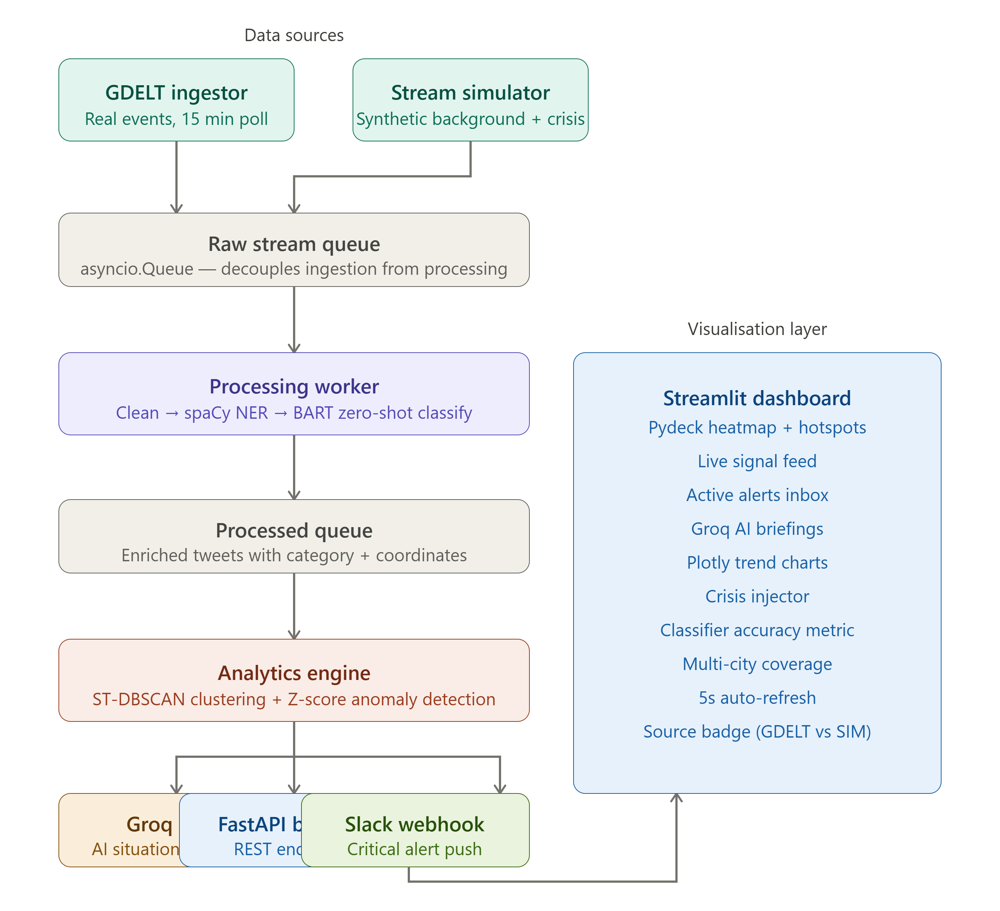

# 🛡️ AegisStream: Real-Time Crisis Signal Detector

AegisStream is a real-time AI-powered crisis intelligence system that ingests live data streams from **GDELT** (Google's global event database) and a simulation engine, detects emerging crisis events using **Spatio-Temporal DBSCAN clustering** and **Z-score anomaly detection**, classifies signals using a **zero-shot BART transformer**, generates **AI-powered situation briefings** via Groq LLM, and visualises everything on a live interactive Streamlit dashboard with instant **Slack notifications**.

> Used by real humanitarian organisations — GDELT is the same open-source global event database used by UN Global Pulse and Google Ideas.

---

## 🏗️ System Architecture




+------------------+     (Real Events)    +-------------------+

|  GDELT Ingestor  | -------------------> |                   |

|  (Every 15 min)  |                      |  Raw Stream Queue |

+------------------+                      |  (asyncio.Queue)  |

|                   |

+------------------+     (Sim Events)     |                   |

| Stream Simulator | -------------------> |                   |

| (Background +    |                      +-------------------+

|  Crisis Events)  |                                |

+------------------+                               v

+-------------------+

| Processing Worker |

| • Text cleaning   |

| • spaCy NER geo   |

| • BART zero-shot  |

|   classifier      |

+-------------------+

|

v

+-------------------+

| Analytics Engine  |

| • ST-DBSCAN       |

| • Z-score anomaly |

| • Alert lifecycle |

+-------------------+

|

┌─────────────────────┼──────────────────────┐

v                     v                      v

+------------------+  +------------------+  +------------------+

|   Groq LLM       |  |  Slack Webhook   |  |  FastAPI Backend |

| Situation Brief  |  |  Notifications   |  |  REST Endpoints  |

+------------------+  +------------------+  +------------------+

|

v

+------------------+

| Streamlit Dashboard|

| • Pydeck Heatmap  |

| • Live Feed       |

| • Alert Inbox     |

| • Plotly Charts   |

+------------------+

---

## ✨ Key Features

| Feature | Description |
|---------|-------------|
| 🌐 **GDELT Ingestion** | Polls real-world crisis events every 15 minutes — no API key needed |
| 🤖 **Zero-Shot BART** | Classifies crisis type with no training data using `facebook/bart-large-mnli` |
| 📍 **spaCy NER** | Extracts geo-locations from post text for precise mapping |
| 🔬 **ST-DBSCAN** | Spatio-temporal clustering detects localised crisis event clusters |
| 📊 **Z-Score Anomaly** | Detects velocity spikes against 30-minute rolling baseline |
| 🧠 **Groq LLM Briefings** | Auto-generates 3-sentence situation reports per alert using Llama 3 70B |
| 🔔 **Slack Notifications** | Instant rich-format alerts pushed to Slack on Critical events |
| 🗺️ **Live Heatmap** | Pydeck WebGL map with dynamic centroid, pulse markers, and heatmap layer |
| 🎯 **Accuracy Metric** | Real-time classifier accuracy tracked against simulator ground truth |
| 🏙️ **Multi-City** | Covers London, New Delhi, Dhaka, and Jakarta |
| 💉 **Crisis Injector** | Manual crisis injection for live demos with preset test buttons |

---

## 🛠️ Installation & Setup

### 1. Prerequisites
- Python 3.10+
- Git

### 2. Clone the Repository
```powershell
git clone https://github.com/Sayar2003/real-time_crisis.git
cd real-time_crisis/crisis-detector
```

### 3. Create Virtual Environment
```powershell
python -m venv .venv
.\.venv\Scripts\Activate.ps1
```

### 4. Install Dependencies
```powershell
pip install -r requirements.txt
```

### 5. Download spaCy Model
```powershell
python -m spacy download en_core_web_sm
```

### 6. Configure Environment Variables
Copy `.env.example` to `.env` and fill in your keys:
GROQ_API_KEY=your_groq_key_here

SLACK_WEBHOOK_URL=your_slack_webhook_here

Get free keys:
- **Groq API** (free): https://console.groq.com
- **Slack Webhook** (free): https://api.slack.com/apps

---

## 🚀 Running the Application

### Step 1 — Start the Backend
```powershell
python -m uvicorn backend.app.main:app --reload --host 127.0.0.1 --port 8000
```

Wait until you see:
Zero-shot classifier loaded successfully.

AegisStream pipeline workers started.

GDELT Ingestor started — polling every 15 minutes.

### Step 2 — Start the Dashboard
In a new terminal:
```powershell
streamlit run frontend/dashboard.py
```

Dashboard opens at: http://localhost:8501
API docs available at: http://localhost:8000/docs

---

## 🎯 Live Demo — How to Test

1. Open the dashboard at http://localhost:8501
2. Watch real GDELT crisis events appear marked with **🌐 GDELT** in the feed
3. Use the **Manual Crisis Injector** in the sidebar:
   - Select category: `Fire`
   - Select landmark: `London Eye`
   - Click **🚨 Inject Crisis Event**
4. Within 5-10 seconds you will see:
   - 🔴 Red cluster appearing on the heatmap centered on London Eye
   - Alert card in the **Active Alerts Inbox** with Z-score and volume
   - **🤖 Groq AI Intelligence Briefing** generated automatically
   - Slack notification delivered to your `#crisis-alerts` channel
   - Spike in the Fire category on the trend chart
5. Alert auto-resolves after 5 minutes of no new signals

---

## 📁 Project Structure
crisis-detector/

├── backend/

│   └── app/

│       ├── main.py              # FastAPI app + async worker orchestration

│       ├── config.py            # All configuration constants

│       ├── simulator.py         # Synthetic social media stream generator

│       ├── gdelt_ingestor.py    # GDELT real-world event ingestion

│       ├── processor.py         # NLP pipeline (clean → NER → classify)

│       ├── analytics.py         # ST-DBSCAN + Z-score anomaly detection

│       ├── llm.py               # Groq LLM alert summary generation

│       ├── notifier.py          # Slack webhook notifications

│       └── templates.py         # Shared text templates

├── frontend/

│   └── dashboard.py             # Streamlit real-time dashboard

├── .env.example                 # Environment variable template

├── requirements.txt

└── README.md

---

## 🧠 How the Classifier Works

| Layer | Method | Speed |
|-------|--------|-------|
| 1. Keyword triage | Fast pattern match across crisis terms | ~0.1ms |
| 2. Negation filter | Removes drills, fiction, historical posts | ~0.1ms |
| 3. spaCy NER | Extracts country/city names | ~5ms |
| 4. Zero-shot BART | Assigns category + confidence score | ~200ms |
| 5. Confidence threshold | Only accepts predictions above 40% | ~0.1ms |

---

## 🔬 Anomaly Detection

### ST-DBSCAN Clustering
Groups posts by spatial proximity (~1.1km radius) and temporal proximity (3-minute window). Requires minimum 4 posts to form a valid cluster — prevents single-post noise from triggering alerts.

### Z-Score Velocity Detection
Maintains a 30-minute rolling baseline of posts per category per minute. Fires an alert when current rate exceeds 3 standard deviations above baseline. Requires minimum 5 non-zero baseline bins before alerting — prevents cold-start false positives.

---

## 🌍 Monitored Regions

| City | Country | Landmarks |
|------|---------|-----------|
| London | UK | Big Ben, London Eye, Tower Bridge, Hyde Park + 6 more |
| New Delhi | India | India Gate, Red Fort, Connaught Place + 5 more |
| Dhaka | Bangladesh | Motijheel, Gulshan, Dhanmondi + 4 more |
| Jakarta | Indonesia | Monas, Kota Tua, Sudirman + 4 more |

---

## 🔧 Tech Stack

| Layer | Technology |
|-------|-----------|
| Backend API | FastAPI + Uvicorn |
| Async Pipeline | Python asyncio |
| NLP Classifier | HuggingFace Transformers (BART) |
| NER | spaCy en_core_web_sm |
| Clustering | scikit-learn DBSCAN |
| Real Data | GDELT Project |
| LLM Summaries | Groq API (Llama 3 70B) |
| Notifications | Slack Incoming Webhooks |
| Dashboard | Streamlit |
| Map | Pydeck (WebGL) |
| Charts | Plotly |
| Storage | Python deque (in-memory) |

---

## 📄 License

MIT License — free to use, modify, and distribute.

---
